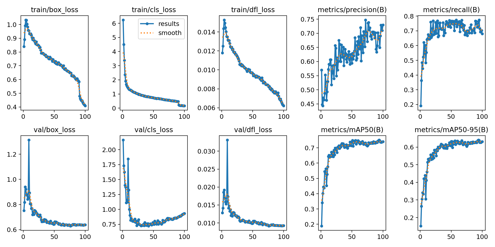
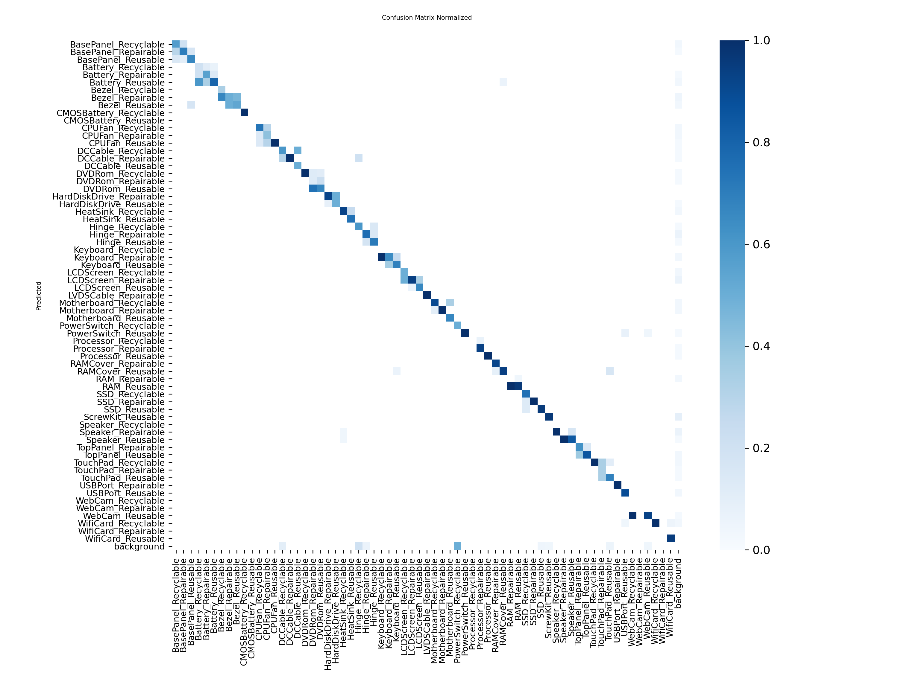

# ♻️ E-Waste Component Detection using YOLOv26n

This repository documents my learning journey in **Computer Vision** and **YOLO-based object detection**.

The project focuses on detecting and classifying laptop/PC components into:

* ♻️ Recyclable
* 🔧 Repairable
* 🔁 Reusable

using **YOLOv26n (Ultralytics)**.

---

## 📌 Project Overview

* Model: **YOLOv26n**
* Framework: **Ultralytics 8.4.14**
* Purpose: Multi-class object detection for categorized e-waste components
* GPU: NVIDIA RTX 3050 Laptop GPU (4GB VRAM)

---

## 📊 Dataset Details

### Dataset Used

[https://www.kaggle.com/datasets/shafin808s/ewaste-yolo](https://www.kaggle.com/datasets/shafin808s/ewaste-yolo)

### Dataset Split

| Set   | Percentage | Images |
| ----- | ---------- | ------ |
| Train | 88%        | 7644   |
| Valid | 8%         | 728    |
| Test  | 4%         | 364    |

---

## 🖼️ Preprocessing & Augmentations

### Preprocessing

* ✅ Auto-Orient applied
* ✅ Resize: `640x640` (Stretch)

### Augmentations (3 outputs per training image)

* 🔄 Horizontal Flip
* 🔄 Vertical Flip
* 🎨 Saturation: -25% to +25%
* 💡 Brightness: -23% to +23%
* 🔹 Noise: Up to 0.1% of pixels

---

## 🧠 Model Summary

```
YOLO26n (fused)
Layers: 122  
Parameters: 2,389,850  
GFLOPs: 5.3
```

**Environment:**

* Ultralytics 8.4.14
* Python 3.10.19
* torch 2.11.0.dev20260209+cu128
* CUDA 12.8
* GPU: NVIDIA GeForce RTX 3050 Laptop GPU (4096 MiB)

---

## 📈 Overall Validation Performance

Validation set: **728 images | 730 instances**

| Metric    | Value     |
| --------- | --------- |
| Precision | 0.643     |
| Recall    | 0.769     |
| mAP@50    | 0.757     |
| mAP@50-95 | **0.653** |

### ⚡ Inference Speed (per image)

* 0.4 ms preprocess
* 3.3 ms inference
* 0.3 ms postprocess

---

## 📉 Training Curves



*(Loss decreased steadily with final stabilization around ~0.65 mAP50-95)*

---

## 📊 Confusion Matrix



*Strong diagonal dominance indicating good per-class separation.*

---

## 🏆 Strong Performing Classes (mAP50-95 ≥ 0.85)

* HeatSink_Recyclable (0.899)
* HeatSink_Reusable (0.861)
* HardDiskDrive_Repairable (0.874)
* LCDScreen_Repairable (0.900)
* LCDScreen_Reusable (0.857)
* LVDSCable_Repairable (0.899)
* Motherboard_Recyclable (0.897)
* RAMCover_Repairable (0.853)
* RAMCover_Reusable (0.852)
* RAM_Reusable (0.871)
* SSD_Reusable (0.883)
* TopPanel_Reusable (0.806 → near strong)
* TouchPad_Reusable (0.849 → near strong)

---

## ⚠️ Low Performing Classes (Data Scarcity Issue)

Some classes have very low image counts (1–3 images), causing unstable metrics:

* Keyboard_Recyclable (0.00)
* WebCam_Recyclable (0.00)
* CPUFan_Reusable (only 1 image)
* Motherboard_Repairable (1 image)
* SSD_Repairable (1 image)
* RAM_Repairable (2 images)
* HardDiskDrive_Reusable (2 images)

These clearly require more samples for stable learning.

---

## 🚀 Key Observations

* Model converges cleanly without instability.
* Recall (0.769) is stronger than Precision (0.643) → model favors detection sensitivity slightly.
* Achieving **0.653 mAP50-95** with:

  * 4GB VRAM constraint
  * 50+ fine-grained classes
  * Heavy class imbalance

is a strong result for a nano model.

* Performance heavily correlates with per-class data availability.

---

## 🔮 Future Improvements

* Add more samples for low-frequency classes.
* Try larger variants (YOLOv26s / YOLOv26m).
* Apply class-balanced sampling.
* Increase training epochs.
* Tune augmentation strength.
* Try weighted loss for minority classes.

---

## 🛠️ How to Train

```bash
pip install ultralytics
```

```python
from ultralytics import YOLO

model = YOLO("YOLOv26n.pt")

model.train(
    data="data.yaml",
    imgsz=640,
    epochs=100,
    batch=16
)
```

---

## 🎯 Goal of This Repository

This project is part of my deep dive into:

* Computer Vision
* Object Detection
* Model Evaluation
* Dataset Engineering
* Real-world deployment constraints (low VRAM training)

---

If you're reading this — feedback is welcome.
This is a continuous learning project.
